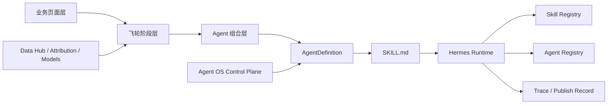
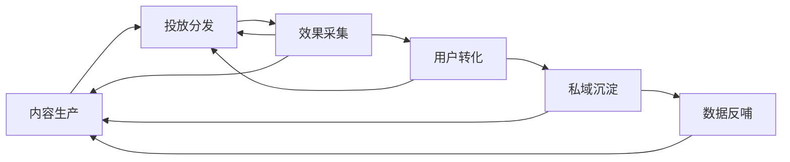

# AI 内容飞轮引擎总蓝图设计

- Date: 2026-04-23
- Repository: `/Users/any/Documents/code/beukay/marketing-person-center`
- Status: 方案 A 已在对话中确认，本文档已写入，待用户审阅
- Scope: Layer 2 首个总蓝图 —— 以飞轮为主轴定义 AI 内容飞轮引擎、业务页面分组与 Agent 构建顺序

## 1. 背景

当前项目的 **Layer 1 Agent OS 底座** 已具备第一阶段可用性：

- Spring Boot 侧已打通 `AgentDefinition -> SKILL.md -> Hermes -> SkillRegistry / AgentRegistry / AgentTrace` 的最小发布闭环
- Agent OS 五个管理页面已完成真实接口接入
- 前端已有较完整的业务页面原型，覆盖内容、投放、数据、消费者、私域、模型与系统治理

这意味着项目已经具备两个前提：

1. **有底座**：可以定义、发布、注册、追踪 Agent
2. **有业务承载面**：前端已经存在“飞轮相关业务页面”，可以作为后续 Agent 落位的业务入口

因此，Layer 2 不适合再按“先把 Agent Matrix 里所有 agent 一次性做完”的方式推进，而应该改为：

> **以飞轮为主轴，以业务页面为入口，以 Agent 为工作单元，以 Hermes 为执行运行时。**

## 2. 结论

本阶段采用 **方案 A：先完成 AI 内容飞轮引擎总蓝图，再按飞轮阶段逐个落地 Agent**。

这是当前最合理的推进方式，因为它同时满足四个目标：

- 不脱离现有前端业务页面
- 不把 Agent OS 误当成业务主界面
- 能把 64 个业务 Agent 放入统一业务闭环，而不是散落成静态矩阵
- 便于后续按阶段分批交付，而不是一次性铺开全部 Agent

## 3. 核心设计原则

## 3.1 飞轮优先，不以 Agent Matrix 为主轴

Agent Matrix 更适合做：

- 能力地图
- 运行总览
- 搜索/筛选入口
- 横向资产盘点

但它不适合作为 Layer 2 的主建模轴。真正驱动业务目标的是飞轮闭环：

`内容生产 -> 投放分发 -> 效果采集 -> 用户转化 -> 私域沉淀 -> 数据反哺 -> 下一轮内容生产`

因此，**飞轮是业务主轴，Agent Matrix 是能力索引层**。

## 3.2 页面优先，Agent 隐于页面之后

业务人员首先看到的不是“某个 AgentDefinition”，而是业务页面：

- AI 内容飞轮引擎
- 内容生产中心
- AI 投放系统
- 归因分析中心
- 消费者运营中心
- 私域运营中心
- 数据与模型中心

因此 Layer 2 的正确关系是：

`业务页面 -> 飞轮阶段 -> Agent 组合 -> AgentDefinition / Skill / Registry / Trace`

也就是说，**页面是业务入口，Agent 是页面背后的工作者，Agent OS 是构建与治理平面**。

## 3.3 Agent OS 属于支撑平面，不属于飞轮业务页面

Agent Studio、Agent Registry、Skill Registry、Agent Identity、Execution Tracker 的职责是：

- 构建 Agent
- 发布到 Hermes
- 管理版本
- 管理身份
- 观测执行与发布记录

它们不是业务人员操作内容飞轮的主界面，因此在信息架构上应被定义为：

> **支撑平面 / Agent Control Plane**

而不是任何单条飞轮里的业务节点。

## 3.4 Hermes 是执行层，不是 Studio 层

Hermes 在本项目中的角色已经明确：

- 执行确定性 `SKILL.md`
- 承担 skill 调用与 runtime 运行
- 支持并行委托、定时任务、事件触发等后续能力

因此本项目中推荐的职责边界是：

- **Spring Boot**：元数据、发布、身份、注册、观测
- **Hermes**：执行与调度
- **Frontend**：业务页面与控制台

## 4. 非目标

本总蓝图阶段不直接做以下事情：

- 一次性实现全部 64 个业务 Agent
- 一次性打通所有第三方平台 API
- 在本阶段引入新的 Maven 模块
- 直接重构所有现有页面
- 在本阶段完成 Gateway 鉴权、OTel、Webhook、Cron 全套生产化
- 让 Agent Matrix 成为唯一真相来源

本阶段只做三件事：

1. 定义完整飞轮蓝图
2. 把现有业务页面全部归入飞轮
3. 给出 Agent 的推荐落地顺序与最小闭环切分方式

## 5. 总体架构



### 5.1 三层含义

#### 业务页面层
用户可直接操作的前端页面，例如：

- `/flywheel`
- `/content`
- `/ads`
- `/attribution`
- `/consumer`
- `/private-domain`
- `/data-hub`
- `/models`

#### 飞轮阶段层
把页面归到六个闭环阶段中，形成稳定业务主轴。

#### Agent 组合层
每个阶段由若干业务 Agent 共同完成，不要求页面和 Agent 一一对应，而是允许：

- 一个页面驱动多个 Agent
- 一个 Agent 服务多个页面
- 一个阶段由多个页面组成一个业务包

## 6. AI 内容飞轮引擎的六阶段定义

## 6.1 阶段 1：内容生产

### 业务目标
完成从趋势识别到内容产出、素材入库、合规审核的完整生产链路。

### 页面职责
**主页面**：

- `/flywheel`
- `/content`
- `/content/script`
- `/content/video`
- `/content/creative`
- `/content/review`
- `/asset-library`

**支撑页面**：

- `/trends`
- `/competitive`
- `/livestream`

### Agent 组合
共 14 个 Agent：

- 种草文案智能体
- 短视频脚本智能体
- 直播话术智能体
- 产品图生成智能体
- 试色视频智能体
- 直播切片智能体
- 美妆教程生成智能体
- 成分科普智能体
- 用户 UGC 激励智能体
- 内容合规审核智能体
- 爆款预测智能体
- 竞品内容监控智能体
- 搜索内容优化智能体
- 直播间视觉优化智能体

> 注：用户给出的 14 个业务 Agent 与现有页面原型高度对应；其中“趋势”更适合作为内容生产阶段的输入能力与底层模型来源，而不是在本阶段再额外多加一个第 15 个业务 Agent。

### 阶段产出
- 脚本
- 图像素材
- 视频素材
- 合规通过内容
- 打标入库素材
- 内容评分结果

## 6.2 阶段 2：投放分发

### 业务目标
把已审核内容转化为跨平台投放动作，包括人群定向、出价、预算节奏与素材轮换。

### 页面职责
**主页面**：

- `/ads`
- `/ads/campaigns`
- `/ads/douyin`
- `/ads/xiaohongshu`
- `/ads/kuaishou`
- `/ads/platforms`
- `/ads/budget`
- `/ai-launch`
- `/automation`

**支撑页面**：

- `/livestream`
- `/inventory`
- `/audience`

### Agent 组合
共 14 个 Agent：

- 抖音智能投手智能体
- 小红书聚光优化智能体
- 快手磁力引擎智能体
- 素材轮换智能体
- 智能出价智能体
- 人群定向智能体
- 直播间投流智能体
- ROI 监控智能体
- 预算分配智能体
- Meta 广告智能投手
- TikTok 全球投流智能体
- Google/YouTube 智能体
- Amazon DSP 智能体
- 库存联动投放智能体

### 阶段产出
- 投放计划
- 平台预算分配
- 素材投放映射
- 受众包
- 出价策略
- 实时投流动作

## 6.3 阶段 3：效果采集

### 业务目标
把投放与转化结果回流成可分析、可归因、可实验、可风控的数据资产。

### 页面职责
**主页面**：

- `/data-hub`
- `/attribution`
- `/analytics`
- `/experiments`
- `/anti-fraud`
- `/reports`
- `/ai-tracker`

**支撑页面**：

- `/data-warehouse`
- `/events`

### Agent 组合
共 6 个 Agent：

- 归因分析智能体
- 种草→购买归因引擎
- A/B 实验自动化引擎
- 反欺诈检测引擎
- 数仓调度引擎
- 品牌舆情监测引擎

### 阶段产出
- 多触点归因结果
- ROI / 异常告警
- A/B 实验结论
- 数据仓宽表与指标集
- 舆情与风险信号

## 6.4 阶段 4：用户转化

### 业务目标
将曝光与点击沉淀为首购、复购、LTV 提升与流失预警。

### 页面职责
**主页面**：

- `/consumer`
- `/revenue`

**支撑页面**：

- `/workbench`
- `/audience`

### Agent 组合
共 9 个 Agent：

- 社群运营智能体
- 跨平台协同智能体
- 实时趋势捕捉引擎
- 复购激活智能体
- 新用户激活智能体
- 个性化推荐智能体
- 会员权益精细化运营智能体
- 用户生命周期预测智能体
- 购后体验优化智能体

### 阶段产出
- 用户分层结果
- CVR 提升动作
- LTV 预测与召回名单
- 推荐结果
- 激活 / 复购任务包

## 6.5 阶段 5：私域沉淀

### 业务目标
把交易用户沉淀进社群、达人、UGC、口碑与裂变网络，形成长期留存资产。

### 页面职责
**主页面**：

- `/private-domain`
- `/operations`
- `/kol-discovery`
- `/sentiment`

**支撑页面**：

- `/localization`
- `/audience`
- `/livestream`

### Agent 组合
共 17 个 Agent：

- KOL 筛选智能体
- 达人招募智能体
- Brief 生成智能体
- 达人维护智能体
- 佣金结算智能体
- 直播排期智能体
- 粉丝质量检测智能体
- 消费者洞察引擎
- 跨境内容本地化智能体
- 国际受众建模智能体
- 全渠道旅程编排智能体
- AI 智能客服智能体
- 评论口碑运营智能体
- 裂变增长智能体
- 社群内容治理智能体
- 消费者情绪洞察智能体
- 跨渠道频次管控智能体

### 阶段产出
- 达人合作池
- 社群运营动作
- UGC 激励与治理结果
- 裂变任务
- 评论与口碑运营动作
- 触达与频控策略

## 6.6 阶段 6：数据反哺

### 业务目标
把前五个阶段的结果沉淀为下一轮模型更新、策略调整与飞轮加速输入。

### 页面职责
**主页面**：

- `/ai-decisions`
- `/models`
- `/data-warehouse`
- `/alerts`

**支撑页面**：

- `/flywheel`
- `/events`
- `/system`

### Agent 组合
共 4 个 Agent：

- 智能预警引擎
- 飞轮闭环引擎
- 汇率风险管理智能体
- 全球隐私合规智能体

### 阶段产出
- 模型更新任务
- 策略调整建议
- 风险告警
- 下一周期飞轮参数

## 7. 全量业务页面分组图

下面给出现有前端业务页面的推荐归组。这里的分组基于当前仓库路由、页面命名与页面内容推断得出，属于 **架构归组**，不是要求立刻重构路由。

## 7.1 主飞轮页面分组

| 飞轮阶段 | 页面路由 | 说明 |
|---|---|---|
| 内容生产 | `/flywheel` | 飞轮总览与阶段看板 |
| 内容生产 | `/content` | 内容生产总入口 |
| 内容生产 | `/content/manga` | 漫画/IP 内容实验页，可视为内容生产扩展工作台 |
| 内容生产 | `/content/script` | 脚本生成与编辑 |
| 内容生产 | `/content/video` | 视频生产 |
| 内容生产 | `/content/creative` | 创意素材生成 |
| 内容生产 | `/content/review` | 内容审核 |
| 内容生产 | `/asset-library` | 素材库 |
| 投放分发 | `/ads` | AI 投放总控台 |
| 投放分发 | `/ads/campaigns` | 活动管理 |
| 投放分发 | `/ads/douyin` | 抖音投放 |
| 投放分发 | `/ads/xiaohongshu` | 小红书投放 |
| 投放分发 | `/ads/kuaishou` | 快手投放 |
| 投放分发 | `/ads/tiktok-global` | 跨境投放执行入口 |
| 投放分发 | `/ads/google` | Google/YouTube 投放 |
| 投放分发 | `/ads/platforms` | 平台管理 |
| 投放分发 | `/ads/budget` | 预算结算 / 节奏控制 |
| 投放分发 | `/ai-launch` | AI 引导投放发起 |
| 投放分发 | `/automation` | 自动化执行策略 |
| 效果采集 | `/data-hub` | 数据采集与同步 |
| 效果采集 | `/attribution` | 归因分析 |
| 效果采集 | `/analytics` | 分析中心 |
| 效果采集 | `/experiments` | 实验中心 |
| 效果采集 | `/anti-fraud` | 反欺诈 |
| 效果采集 | `/reports` | 报表中心 |
| 效果采集 | `/ai-tracker` | Agent 执行与追踪观测 |
| 用户转化 | `/consumer` | 用户转化 / 生命周期主页面 |
| 用户转化 | `/revenue` | 收入与转化结果 |
| 私域沉淀 | `/private-domain` | 私域主页面 |
| 私域沉淀 | `/operations` | 运营生态工作台 |
| 私域沉淀 | `/kol-discovery` | 达人发现 |
| 私域沉淀 | `/sentiment` | 口碑 / 情绪 / 社群信号 |
| 数据反哺 | `/ai-decisions` | 决策中心 |
| 数据反哺 | `/models` | 模型中心 |
| 数据反哺 | `/data-warehouse` | 数仓层 |
| 数据反哺 | `/alerts` | 风险预警 |

## 7.2 共享输入与支撑页面

| 类型 | 页面路由 | 说明 |
|---|---|---|
| 公共情报输入 | `/trends` | 趋势输入，优先服务内容生产与用户转化 |
| 公共情报输入 | `/competitive` | 竞品输入，优先服务内容生产与投放分发 |
| 公共情报输入 | `/audience` | 受众输入，服务投放、人群、私域、转化 |
| 公共情报输入 | `/livestream` | 直播信号，贯穿内容、投放、私域 |
| 国际扩展输入 | `/intl/dashboard` | 当前先视作投放分发 / 私域沉淀的国际扩展视图 |
| 国际扩展输入 | `/intl/facebook` | 国际投放扩展页 |
| 国际扩展输入 | `/intl/tiktok` | 国际投放扩展页 |
| 国际扩展输入 | `/intl/google` | 国际投放扩展页 |
| 国际扩展输入 | `/intl/compliance` | 国际合规与反哺双重支撑 |
| 人工协同 | `/workbench` | 人工兜底入口，优先支撑用户转化与私域沉淀 |
| 系统支撑 | `/events` | 事件总线，支撑采集与反哺 |
| 系统支撑 | `/system` | 系统监控 |
| 系统支撑 | `/settings` | 配置中心 |
| 系统支撑 | `/beukay-claw` | 外部系统 / 抓取支撑能力 |

## 7.3 Agent OS 控制平面

这些页面不应归入某条业务飞轮：

- `/agent-studio`
- `/agent-registry`
- `/skill-registry`
- `/agent-identities`

它们应该在信息架构上独立成：

> **Agent OS / Agent Control Plane**

## 8. Agent 构建的正确落位方式

## 8.1 不是“先建 64 个 AgentDefinition”

错误路径：

- 先在 Agent Matrix 里把 64 个 AgentDefinition 全建出来
- 再去想它们归哪个页面、哪个飞轮、怎么协同

这种方式会导致：

- 业务边界混乱
- 页面与 Agent 脱节
- Runtime 技能大量空转
- 发布出来的 skill 缺少稳定入口与上下文

## 8.2 正确路径：页面包 -> 阶段包 -> Agent 包 -> Definition

推荐采用四层装配方式：

### 第 1 层：页面包
例如“内容生产中心”页面包：

- `/content`
- `/content/script`
- `/content/video`
- `/content/creative`
- `/content/review`

### 第 2 层：阶段包
把页面包绑定到“内容生产阶段”。

### 第 3 层：Agent 包
在这个阶段下，定义该阶段真正需要的 Agent 组：

- 趋势
- 脚本
- 素材
- 审核
- 评分
- 入库

### 第 4 层：Definition / Skill / Registry
等阶段与页面边界稳定后，再把每个 Agent 落成：

- `AgentDefinition`
- `SKILL.md`
- `SkillRegistry`
- `AgentRegistry`
- `AgentTrace`

## 8.3 推荐的 Agent 元数据补充标签

当前底座已经能承载 `AgentDefinition`，但进入 Layer 2 后建议统一增加业务标签（可以先作为扩展字段或 JSON metadata 使用，不要求本阶段立刻改库）：

- `flywheelCode`：如 `AI_CONTENT_FLYWHEEL`
- `stageCode`：如 `CONTENT_PRODUCTION`
- `stageOrder`：1~6
- `businessPageRoute`：主页面路由
- `businessCapability`：能力名
- `triggerMode`：manual / event / cron / webhook
- `inputTopics`：输入事件 / 数据源
- `outputTopics`：输出事件 / 产物
- `approvalPolicy`：自动 / 人工审批 / 强制审核
- `modelProfile`：关联底层模型配置

这些标签的意义是：

> 让 AgentDefinition 不再只是“可发布的说明书”，而是具备明确业务归属的飞轮节点。

## 9. 与当前 Agent Matrix 的关系

当前仓库中的 Agent Matrix 数据主要按以下 cluster 组织：

- `content`
- `marketing`
- `operations`
- `engine`
- `intl`
- `consumer`

它和用户给出的六阶段飞轮并不是一一对应的。

### 9.1 推荐处理方式

不要立刻重写现有 Agent Matrix 数据模型，而是采用：

- **保留 cluster 作为横向能力维度**
- **新增 flywheelStage 作为纵向业务维度**

形成双视图：

- 横向看：内容 / 投放 / 运营 / 国际 / 消费者 / 引擎
- 纵向看：内容生产 / 投放分发 / 效果采集 / 用户转化 / 私域沉淀 / 数据反哺

这样做的好处是：

- 兼容当前前端原型
- 不破坏已有 Matrix 页面
- 后续可以在 Matrix 中新增“按飞轮查看”模式

## 10. 全量 Agent 与阶段映射

## 10.1 推荐的一级映射

| 阶段 | Agent 数量 | 角色定位 |
|---|---:|---|
| 内容生产 | 14 | 负责生产内容与素材 |
| 投放分发 | 14 | 负责把内容转成投放动作 |
| 效果采集 | 6 | 负责回流、归因、实验、风控 |
| 用户转化 | 9 | 负责购买、复购、LTV 与流失控制 |
| 私域沉淀 | 17 | 负责达人、社群、UGC、裂变与口碑 |
| 数据反哺 | 4 | 负责闭环调优与下一周期驱动 |
| 合计 | 64 | AI 内容飞轮全量工作者 |

## 10.2 阶段依赖关系



关键含义：

- 这不是单向漏斗，而是可回流的飞轮
- 效果采集会回灌投放与内容
- 私域沉淀会直接影响下一轮内容选题与创意风格
- 数据反哺是飞轮加速器，而不是单独的数据报表区

## 11. 推荐实施顺序

## 11.1 波次 0：总蓝图（当前）

当前文档完成的就是这一波：

- 确定六阶段总蓝图
- 完成页面归组
- 明确 Agent OS 与业务页面的边界
- 明确 64 个 Agent 的分阶段装配原则

## 11.2 波次 1：内容生产飞轮 MVP

建议下一步优先落地“内容生产阶段”，而不是直接铺全量 64 个 Agent。

推荐先做 5~6 个核心 Agent：

- 趋势捕捉
- 短视频脚本
- 种草文案
- 产品图生成
- 内容合规审核
- 素材入库 / 搜索优化（二选一作为第六个）

推荐优先打通页面：

- `/flywheel`
- `/content`
- `/content/script`
- `/content/creative`
- `/content/review`
- `/asset-library`

推荐优先打通最小业务闭环：

`趋势输入 -> 文案/脚本生成 -> 素材生成 -> 合规审核 -> 素材入库 -> 进入投放候选池`

## 11.3 波次 2：投放分发核心闭环

在内容生产 MVP 稳定后，接投放分发阶段：

- 素材轮换智能体
- 智能出价智能体
- 人群定向智能体
- 平台投手智能体
- ROI 监控智能体
- 预算分配智能体

形成第二条关键链路：

`已审核素材 -> 自动建计划 -> 平台投放 -> ROI 监控 -> 预算调节`

## 11.4 波次 3：效果采集 + 数据反哺

这是飞轮真正能“转起来”的关键波次：

- 归因分析智能体
- A/B 实验自动化引擎
- 数仓调度引擎
- 飞轮闭环引擎
- 智能预警引擎

形成：

`投放结果 -> 数据采集 -> 归因/实验 -> 调优建议 -> 反哺上游`

## 11.5 波次 4：用户转化 + 私域沉淀

最后补强用户经营与长期留存：

- 个性化推荐
- 新用户激活
- 复购激活
- 用户生命周期预测
- 全渠道旅程编排
- AI 智能客服
- 裂变增长
- 社群内容治理

## 12. 第一条真正应该落地的“最小业务闭环”

虽然本文件是总蓝图，但从工程推进角度，第一条最值得先做的链路应当是：

```text
趋势洞察 -> 内容生成 -> 合规审核 -> 素材入库 -> 投放候选池
```

理由：

1. 与 Hermes 的 skill 形态最匹配
2. 与当前前端页面最容易对应
3. 输入输出边界最清晰
4. 最容易快速形成可演示闭环
5. 能直接复用当前 Agent OS 发布链路

## 13. 风险与注意事项

## 13.1 页面很多，但不要等于 Agent 很多

一个页面可以承载多个 Agent；不要强制一页一个 Agent。

## 13.2 Agent 名称需要统一口径

当前仓库中的 Agent Matrix 命名、用户新给出的飞轮命名、模型中心命名三套口径并不完全一致。进入实施前需要统一：

- 展示名
- Agent 唯一编码
- skillId 生成规则
- 所属阶段
- 对应页面

## 13.3 国际页面先作为扩展视图，而不是单独主飞轮

当前用户给出的这轮蓝图是“AI 内容飞轮引擎”六阶段，国际投放相关能力可以先挂靠到“投放分发 / 私域沉淀 / 数据反哺”三个阶段中，不急于在这份蓝图里再拆出第七条飞轮。

## 13.4 Agent OS 不要再次业务化

Agent OS 的目标是让业务人员能定义和发布 Agent，但不应该把它做成业务工作台。真正的业务工作台仍应是飞轮页面本身。

## 14. 本文档后的下一步建议

基于本总蓝图，下一份文档应切到：

> **内容生产飞轮 MVP 设计**

建议范围：

- 页面：`/flywheel` + `/content` + `/content/script` + `/content/creative` + `/content/review` + `/asset-library`
- Agent：趋势、文案、脚本、产品图、合规、入库
- 目标：用现有底座生成并发布第一批真正可运行的业务 AgentDefinition 与 Hermes skills

## 15. 最终结论

当前项目进入 Layer 2 后，正确的推进方式不是“先从 AgentMatrix 批量造 Agent”，而是：

> **先完成 AI 内容飞轮引擎总蓝图，完成页面归组，再从内容生产阶段开始逐个搭建 Agent。**

这保证了后续每一个 Agent 都有：

- 明确业务页面入口
- 明确飞轮阶段归属
- 明确上下游关系
- 明确 Hermes 发布与运行位置
- 明确观测与注册路径

这样搭出来的 Agent，才是业务飞轮里的工作者，而不是静态展示卡片。
