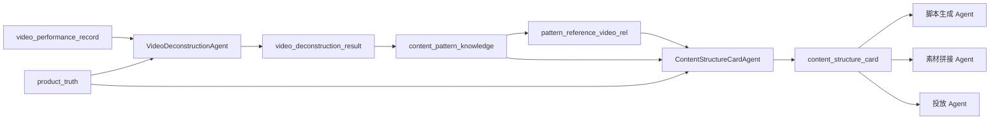

# 内容生产内循环：双 Agent + 知识库架构设计

- Date: 2026-04-23
- Repository: `/Users/any/Documents/code/beukay/marketing-person-center`
- Status: 已在对话中确认方向，本文档已写入，待用户审阅
- Scope: 将“内容拆解 + 结构卡生成”从单 Agent 方案升级为“双 Agent + 知识库解耦”方案

---

## 0. 同行评审采纳结论

本轮吸收了 Gemini 同行评审的 5 个建议，处理结果如下：

| 建议 | 采纳情况 | 处理方式 |
|---|---|---|
| 知识层增加向量检索能力 | ✅ 部分采纳 | V1 保持关系检索为主，但在知识层预留 `pattern_embedding` 扩展字段；V2 再接向量索引与语义召回 |
| 增加反馈回路分数 | ✅ 采纳 | 在拆解结果/知识条目中增加 `actual_performance_score`，作为后续反哺同步字段 |
| 增加冷启动校验状态 | ✅ 采纳 | 增加 `verification_status`，先跑 50 条抽检通过后再全量 |
| 结构卡输出逻辑溯源 | ✅ 采纳 | 在 `content_structure_card` 中增加 `logic_trace` 字段 |
| 知识条目增加负向规则 | ✅ 采纳 | 在 `content_pattern_knowledge` 中增加 `negative_rules` 字段 |

额外采纳的工程策略：

- **先单条拆解，再模式聚合**：Agent A 先跑单条链路验证 JSON 质量，再开启批量写库与聚合。
- **关系检索优先，语义检索后置**：先保证业务确定性与可解释性，再提升语义弹性。

---

## 1. 背景

当前项目已经完成：

- Agent OS 底座与最小 Hermes 发布闭环
- `video_performance_record / product_truth / content_structure_card` 三张基础表
- 抖音历史视频数据 2930 条导入与初步标签化
- “种籽气垫2.0 + 干皮/混干皮 + 日常投放”作为第一条最小业务闭环目标

原先的 V1 设计把“视频拆解”和“结构卡生成”放在一个 Agent 内部完成。这个方案适合快速验证，但不适合长期生产化。原因是：

1. **两类任务节奏不同**：
   - 视频拆解是离线批量任务
   - 结构卡生成是在线低延迟任务
2. **两类任务产物不同**：
   - 视频拆解产出应沉淀为长期知识资产
   - 结构卡生成产出是一次请求的运行时结果
3. **两类任务复用范围不同**：
   - 知识沉淀不仅服务结构卡，还会服务脚本、素材、投放
   - 结构卡主要服务脚本生成与后续内容生产链路

因此，正确的后端建模方式应改为：

> **双 Agent 独立运行，中间通过内容知识库解耦。**

---

## 2. 结论

本阶段采用如下架构：

### Agent A：视频拆解知识沉淀 Agent
负责批量拆解历史视频与后续新增视频，形成内容知识条目。

### Agent B：结构卡生成 Agent
负责在实时请求时，从知识库中检索最优模式并生成 `ContentStructureCard`。

### 中间层：内容知识库
负责沉淀长期可复用的内容模式、参考视频证据与规则化知识。

因此整体链路变为：

```text
video_performance_record + product_truth
        ↓
[视频拆解知识沉淀 Agent]
        ↓
内容知识库
        ↓
[结构卡生成 Agent]
        ↓
content_structure_card
        ↓
脚本生成 Agent / 素材拼接 Agent / 投放 Agent
```

这不是“两个服务顺序同步调用”的关系，而是：

- Agent A 负责**提前沉淀知识**
- Agent B 负责**实时消费知识**

---

## 3. 为什么必须拆成两个独立 Agent

## 3.1 时序差异

### Agent A：离线型
- 适合批量跑 2930 条历史视频
- 适合每日/每小时增量处理
- 适合通过 cron / 事件回流触发

### Agent B：在线型
- 适合业务人员在页面上即时发起
- 需要低延迟输出
- 不应该现场重扫全量视频库

## 3.2 资产性质差异

### Agent A 产物
是可长期累积、可反复复用的知识资产：
- hook 模式
- 场景模式
- 卖点模式
- CTA 机制
- 标题句式
- 人群适配规则

### Agent B 产物
是运行时消费结果：
- 一张结构卡
- 一次生成任务
- 一次脚本生产上下文

## 3.3 解耦收益

拆成两个 Agent 后，后续可以独立演进：

- Agent A 可以从规则版升级到更强的检索增强版 / 多模态分析版
- Agent B 可以从规则版升级到 Hermes/LLM 增强版
- 内容知识库可以独立服务脚本生成、素材拼接、投放策略

---

## 4. 总体架构



### 4.1 分层说明

#### 原始事实层
- `video_performance_record`
- `product_truth`

#### 知识层
- `video_deconstruction_result`
- `content_pattern_knowledge`
- `pattern_reference_video_rel`

#### 运行时产物层
- `content_structure_card`

### 4.2 关键原则

#### 原始事实层不是知识库
原始视频表仅存放视频事实与效果数据，不直接服务结构卡生成。

#### `content_structure_card` 不是知识库
结构卡是一轮生成任务的结果，不应反向承担知识沉淀职责。

#### 知识库是长期资产层
只有知识层才是后续脚本与内容飞轮长期迭代的核心资产。

---

## 5. Agent A：视频拆解知识沉淀 Agent

## 5.1 定位

### 中文名
视频拆解知识沉淀 Agent

### 代码建议名
- `VideoDeconstructionAgent`
- 或 `VideoKnowledgeBuilderAgent`

### 职责一句话
把历史高性能视频批量拆解成“可复用的内容知识条目”。

## 5.2 输入

### 主输入
- `video_performance_record`
- `product_truth`

### 可选输入（V2）
- 飞书 Top20 热门视频
- 竞品爆款视频
- 评论区高频问题

## 5.3 处理流程

```text
1. 过滤候选视频
2. 对视频做模式识别与标签提取
3. 生成单视频拆解结果
4. 聚合成模式知识条目
5. 建立知识条目与参考视频关系
6. 写入知识库
```

## 5.4 输出

### 输出 1：单视频拆解结果
用于保留每条视频的结构化拆解事实。

### 输出 2：模式知识条目
用于实时生成结构卡时检索。

### 输出 3：参考视频关系
用于结构卡展示“top 参考视频”。

## 5.5 非目标

Agent A 不负责：
- 直接生成脚本文字
- 直接生成结构卡
- 直接调用抖音发布
- 直接做投放策略生成

---

## 6. Agent B：结构卡生成 Agent

## 6.1 定位

### 中文名
结构卡生成 Agent

### 代码建议名
- `ContentStructureCardAgent`
- 或 `ContentKnowledgeRetrieverAgent`

### 职责一句话
根据商品真相与知识库条目，实时生成一张可供下游消费的内容结构卡。

## 6.2 输入

### 业务入参（V1 最小）
- `skuId`
- `targetAudience`
- `marketingNode`

### 系统输入
- `product_truth`
- `content_pattern_knowledge`
- `pattern_reference_video_rel`
- 必要时联查 `video_deconstruction_result`

### 6.2.1 检索策略

#### V1
- 以关系检索为主：`sku_tag + marketing_node + target_audience + hook_type`
- 保证确定性、可解释性和稳定性

#### V2
- 在关系检索基础上叠加语义召回
- 使用 `pattern_embedding` 处理“春天踏青的清爽感”这类模糊 vibe 查询
- 仅在确认 MySQL / 向量索引方案稳定后启用

## 6.3 处理流程

```text
1. 读取 product_truth
2. 检索最匹配的模式知识条目
3. 取出对应 top 参考视频
4. 组合生成 ContentStructureCard
5. 写入 content_structure_card
6. 返回 DTO 给页面/下游 Agent
```

## 6.4 输出

必须至少包含：
- `recommendedHookType`
- `topReferences`
- `patternSummary`
- `storyBeats`
- `ContentStructureCard`

## 6.5 非目标

Agent B 不负责：
- 现场批量扫描全量视频
- 更新知识库
- 做批量视频拆解

---

## 7. 内容知识库设计

## 7.1 表一：`video_deconstruction_result`

### 目标
一条视频拆解出一条结构化事实结果。

### 建议字段
| 字段 | 说明 |
|---|---|
| `id` | 主键 |
| `video_id` | 对应视频 ID |
| `record_id` | 对应 `video_performance_record.id` |
| `sku_tag` | SKU 标签 |
| `hook_type` | 钩子类型 |
| `scene_tags` | 场景标签 JSON |
| `selling_point_tags` | 卖点标签 JSON |
| `cta_tags` | CTA 标签 JSON |
| `title_pattern` | 标题句式 |
| `emotion_tags` | 情绪标签 JSON |
| `target_audience_tags` | 人群标签 JSON |
| `composite_score` | 综合分 |
| `deconstruction_json` | 全量拆解 JSON |
| `version` | 拆解版本 |
| `actual_performance_score` | 后续同步的真实表现分 |
| `verification_status` | PENDING / VERIFIED / REJECTED |
| `status` | ENABLED / DISABLED |
| `base_fields` | 审计字段 |

### 用途
- 保留单视频级别拆解事实
- 支持知识条目重建
- 支持数据反哺再训练

## 7.2 表二：`content_pattern_knowledge`

### 目标
把多条视频聚合为“可检索的内容模式知识”。

### 建议字段
| 字段 | 说明 |
|---|---|
| `id` | 主键 |
| `knowledge_id` | 业务唯一编码 |
| `sku_tag` | SKU 标签 |
| `marketing_node` | 营销节点 |
| `target_audience` | 目标人群 |
| `hook_type` | 推荐 hook 类型 |
| `pattern_type` | 模式类型 |
| `recommended_opening` | 推荐开场 |
| `recommended_selling_points` | 推荐卖点 JSON |
| `recommended_cta` | 推荐 CTA JSON |
| `recommended_scenes` | 推荐场景 JSON |
| `negative_rules` | 负向规则 / 避坑指南 JSON |
| `pattern_score` | 模式分 |
| `actual_performance_score` | 知识条目的真实效果分 |
| `pattern_embedding` | 语义向量扩展位（V1 预留，V2 检索） |
| `knowledge_json` | 全量知识 JSON |
| `version` | 知识版本 |
| `verification_status` | PENDING / VERIFIED / REJECTED |
| `status` | ENABLED / DISABLED |
| `base_fields` | 审计字段 |

### 用途
- 作为 Agent B 的主检索表
- 作为脚本生成 Agent 的知识来源
- 作为内容飞轮的长期资产库

## 7.3 表三：`pattern_reference_video_rel`

### 目标
维护知识条目与参考视频的关系。

### 建议字段
| 字段 | 说明 |
|---|---|
| `id` | 主键 |
| `knowledge_id` | 知识条目编码 |
| `video_id` | 参考视频 ID |
| `record_id` | 对应原始视频记录 |
| `relation_type` | PRIMARY / SECONDARY / COUNTER_EXAMPLE |
| `reference_score` | 参考分 |
| `actual_performance_score` | 该参考关系对应的真实效果分 |
| `base_fields` | 审计字段 |

### 用途
- 支持结构卡返回 top 参考视频
- 支持前端证据展示
- 支持解释型输出

---

## 8. 与现有表的关系

## 8.1 保留现有三张表不变

已存在：
- `video_performance_record`
- `product_truth`
- `content_structure_card`

### 角色重新定义
| 表 | 角色 |
|---|---|
| `video_performance_record` | 原始视频事实层 |
| `product_truth` | 商品真相层 |
| `content_structure_card` | 运行时结构卡产物层（增加 `logic_trace`） |

## 8.2 新增三张知识层表

新增：
- `video_deconstruction_result`
- `content_pattern_knowledge`
- `pattern_reference_video_rel`

这样就形成清晰的三层结构：

```text
事实层 -> 知识层 -> 运行时产物层
```

---

## 9. 两个 Agent 的执行模式

## 9.1 Agent A 的执行模式

### 推荐触发方式
- 手动批量执行：初始化历史数据时
- cron 执行：每日/每小时增量扫描
- 事件触发：效果回流后重新更新知识

### 推荐发布形态
- 独立 `AgentDefinition`
- 独立 `SKILL.md`
- 独立 `AgentTrace`

## 9.2 Agent B 的执行模式

### 推荐触发方式
- 页面按钮触发
- Studio 调用
- 下游脚本 Agent 直接调用

### 推荐发布形态
- 独立 `AgentDefinition`
- 独立 `SKILL.md`
- 独立 `AgentTrace`

---

## 10. 后端实现建议（COLA）

## 10.1 不建议继续做成一个大 AppService 黑箱

原方案中一个 `ContentDeconstructorAppService` 同时负责：
- 检索视频
- 识别模式
- 生成结构卡

现在应拆为两套独立的应用服务：

### Agent A 应用服务
- `VideoKnowledgeBuildAppService`

### Agent B 应用服务
- `ContentStructureCardGenerateAppService`

### 共享基础能力
- `ProductTruthQueryService`
- `PatternKnowledgeRetriever`
- `ReferenceVideoSelector`
- `RuleBasedCardComposer`
- 后续可接 `HermesCardComposer`

## 10.2 第一阶段实现顺序

### Phase B-1：先做 Agent A
1. 落知识层 DDL（含 `actual_performance_score / verification_status / negative_rules / pattern_embedding` 预留）
2. 生成 COLA 对应 DO / Mapper / Gateway / AppService
3. **先跑单条拆解链路**：输入 1 条 `video_performance_record`，验证 `video_deconstruction_result.deconstruction_json` 质量
4. 小样本抽检：先跑 50 条，人工或 Critic Agent 双检，标记 `verification_status`
5. 小样本通过后，再批量将 2930 条视频拆解并写入知识层
6. 在单视频拆解稳定后，再做模式聚合，生成 `content_pattern_knowledge` 与参考视频关系

### Phase B-2：再做 Agent B
1. 定义 `ContentStructureCardGenerateCmd`
2. 检索知识层模式（V1 走关系检索，V2 可叠加向量召回）
3. 生成结构卡
4. 在 `content_structure_card` 中写入 `logic_trace`
5. 写入 `content_structure_card`
6. 返回 DTO 给页面或下游 Agent

---

## 11. 第一版最小验收标准

## 11.1 Agent A 验收

输入：
- 全量 2930 条历史视频

输出：
- 先有单条 `video_deconstruction_result` 成功样例，JSON 结构符合预期
- 前 50 条样本完成抽检并写入 `verification_status`
- `video_deconstruction_result` 有批量结果
- `content_pattern_knowledge` 至少形成“种籽气垫2.0 + 干皮/混干皮 + 日常投放”的核心模式知识
- `pattern_reference_video_rel` 至少关联 3~5 条 top 参考视频

## 11.2 Agent B 验收

输入：
- `skuId = 种籽气垫2.0`
- `targetAudience = 干皮/混干皮`
- `marketingNode = 日常投放`

输出：
- 一张入库成功的 `ContentStructureCard`
- 返回 `recommendedHookType`
- 返回 top 参考视频
- 返回 `storyBeats`
- 返回 `logic_trace`（至少包含 knowledge_id / reference video 依据）

---

## 12. 与后续飞轮的关系

## 12.1 对脚本生成 Agent
脚本生成 Agent 不应直接扫原始视频数据，而应直接消费：
- `content_pattern_knowledge`
- `content_structure_card`

## 12.2 对数据反哺 Agent
数据反哺 Agent 后续更新的对象应是：
- 知识库条目权重
- 模式有效性
- 参考视频关联关系
- `actual_performance_score` 等真实效果反馈字段

而不应直接重写某一张临时结构卡。

## 12.3 对 Hermes/Agent OS
双 Agent 方案更适合 Agent OS：
- 两个 Agent 都可独立发布
- 两个 Agent 都可独立追踪
- 两个 Agent 可分别配置 cron / event / manual trigger

---

## 13. 最终结论

从架构上看，“内容拆解 + 结构卡生成”不应继续被建模为一个单体 Agent。正确方式是：

> **把视频拆解做成知识沉淀 Agent，把结构卡生成做成知识消费 Agent，中间通过内容知识库解耦。**

这样才能满足：

- 批量离线拆解
- 在线低延迟生成
- 长期知识复用
- 多 Agent 共同消费同一知识层
- 后续飞轮数据反哺的稳定演进

因此，接下来的正确实施顺序应为：

1. 先落知识层 DDL 与 Agent A
2. 再落 Agent B 与结构卡生成
3. 最后再接脚本生成 Agent 与前端工作台
